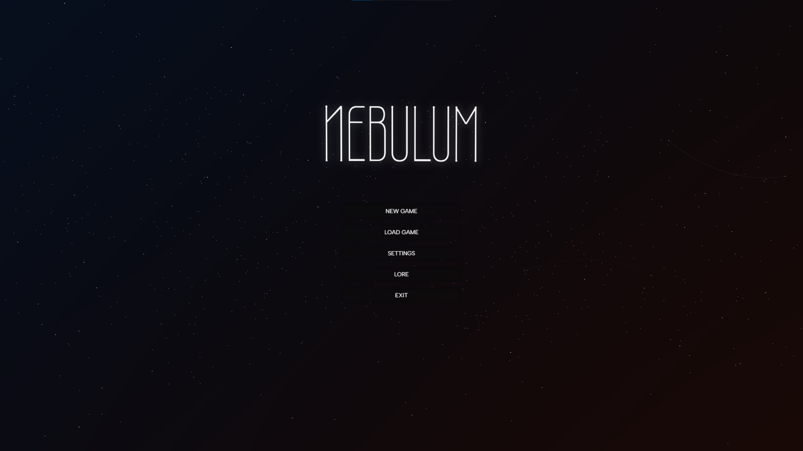
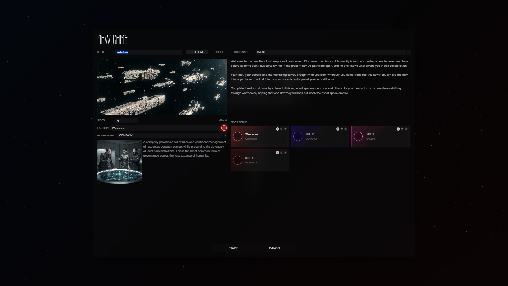
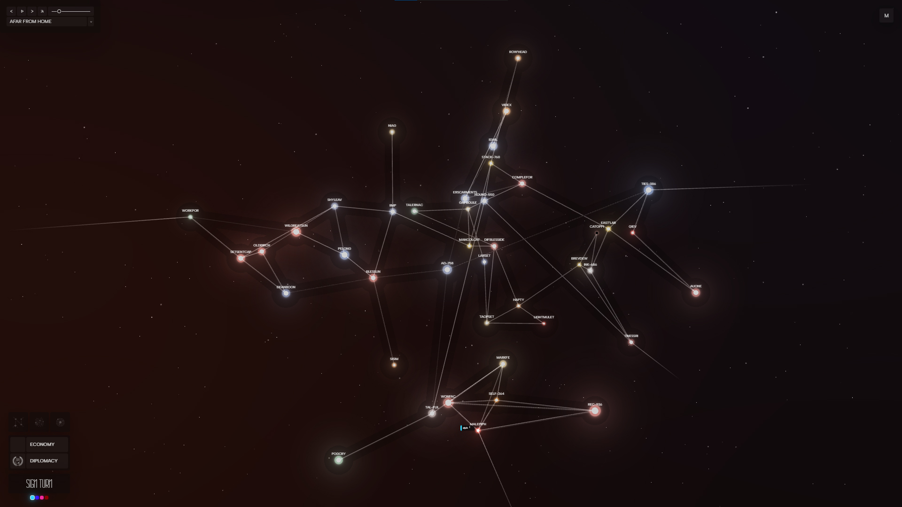
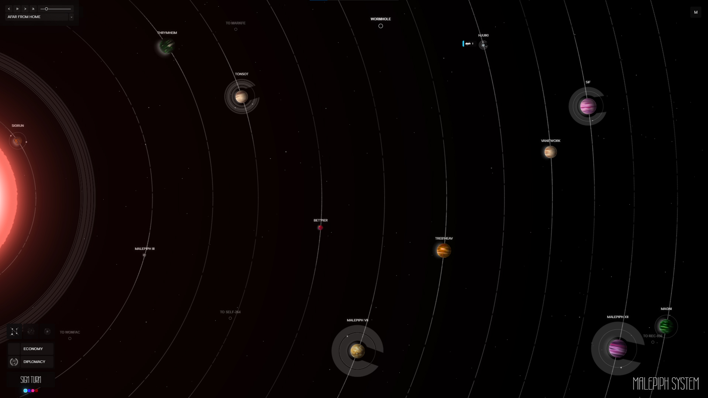
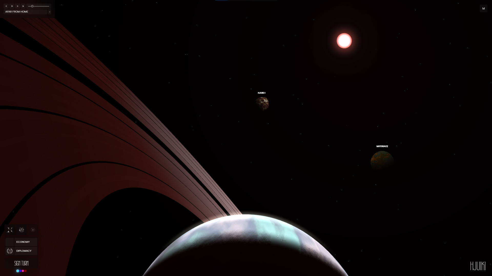
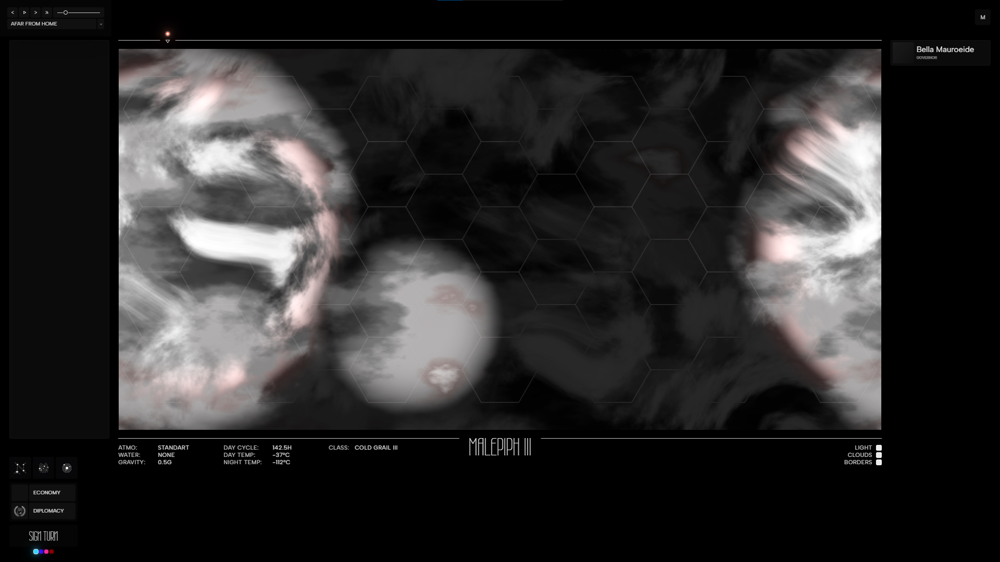

# Nebulum

**Nebulum is a work-in-progress experiment in building a 4X strategy game entirely through neural networks.**

The project follows one deliberate constraint: its creator directs the design, mechanics, and development through prompts and visual testing without reading or manually editing the source code. Neural networks produce the implementation while the human role remains creative direction, playtesting, and feedback.

This approach extends beyond the code:

- Music and sound effects are generated with **Suno**.
- Images and visual assets are generated with **NBP**.

> [!IMPORTANT]
> Nebulum is an early WIP, not a finished game. Mechanics, balance, interfaces, content, and save compatibility may change at any time.

## The Experiment

Nebulum explores whether a playable, interconnected 4X experience can emerge from an AI-only production workflow. The current build combines a seeded galaxy, faction setup, turn-based exploration, star systems, fleets, orbital objects, and planet surfaces in one continuous interface.

The long-term direction follows the core 4X loop:

- **Explore** a procedurally generated galaxy.
- **Expand** across star systems and planets.
- **Exploit** resources, infrastructure, and strategic positions.
- **Exterminate** or outmaneuver competing factions.

## Screenshots

<table>
  <tr>
    <td width="50%">
      
      <br><sub>Main menu</sub>
    </td>
    <td width="50%">
      
      <br><sub>Scenario and faction setup</sub>
    </td>
  </tr>
  <tr>
    <td width="50%">
      
      <br><sub>Galactic map</sub>
    </td>
    <td width="50%">
      
      <br><sub>Star system view</sub>
    </td>
  </tr>
  <tr>
    <td width="50%">
      
      <br><sub>Orbital view</sub>
    </td>
    <td width="50%">
      
      <br><sub>Planet surface</sub>
    </td>
  </tr>
</table>

## Current Features

- Deterministic galaxy generation from a seed.
- Interactive 3D galactic, system, orbital, and planetary views.
- Procedural stars, planets, moons, asteroid belts, and jump points.
- Scenario, faction, government, and hot-seat game setup.
- Fleet movement and turn-based exploration foundations.
- Hex-based planet surfaces and planetary information.
- Built-in AI-generated soundtrack and music player.
- Installable Progressive Web App with offline application-shell support.

## Install on Windows

The included installer is the simplest way to run Nebulum on Windows.

1. Download or clone the repository.
2. Extract it if you downloaded a ZIP archive.
3. Double-click `install.bat`.

The installer will:

- Install the required npm dependencies.
- Build the production PWA.
- Use your compatible Node.js installation or download a private portable runtime into `.nebulum-runtime`.
- Create Nebulum shortcuts on the Desktop and in the Start menu.
- Launch the game in a standalone Chrome or Edge application window when available.

An internet connection is required during the first installation. Application data, browser data, and logs are stored under `%LOCALAPPDATA%\Nebulum`.

## Install as a PWA

Nebulum can be installed from a deployed HTTPS version in a Chromium-based browser such as Chrome or Edge.

1. Open the deployed game.
2. Select **INSTALL PWA** in the main menu, or use the install icon in the browser address bar.
3. Confirm the installation.
4. Launch Nebulum from the Desktop, Start menu, or your browser's app launcher.

To install the PWA from a local production build:

```bash
npm install
npm run build
npm run preview
```

Open the local URL printed in the terminal, then use **INSTALL PWA** in the game or the browser's install action. PWA installation is available on HTTPS origins and on localhost; browser support may vary.

## Development

Manual development requires [Node.js](https://nodejs.org/) and npm. Node.js 22 is used by the deployment workflow.

Install dependencies:

```bash
npm install
```

Start the development server:

```bash
npm run dev
```

Run the automated tests:

```bash
npm test
```

Create and preview a production build:

```bash
npm run build
npm run preview
```

## GitHub Pages

The repository includes a GitHub Actions workflow for GitHub Pages.

1. Open the repository's **Settings**.
2. Select **Pages**.
3. Set **Source** to **GitHub Actions**.
4. Push to the `main` branch or run the workflow manually.

The workflow installs dependencies, builds the project, and deploys the contents of `dist`.

## License

Nebulum is distributed under the [Apache License 2.0](LICENSE).
