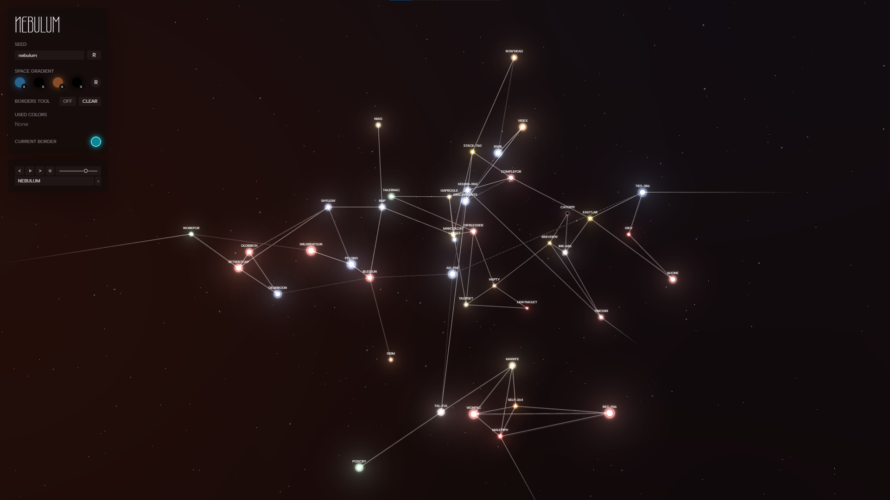
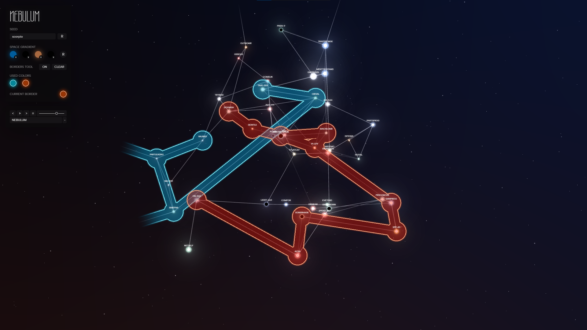
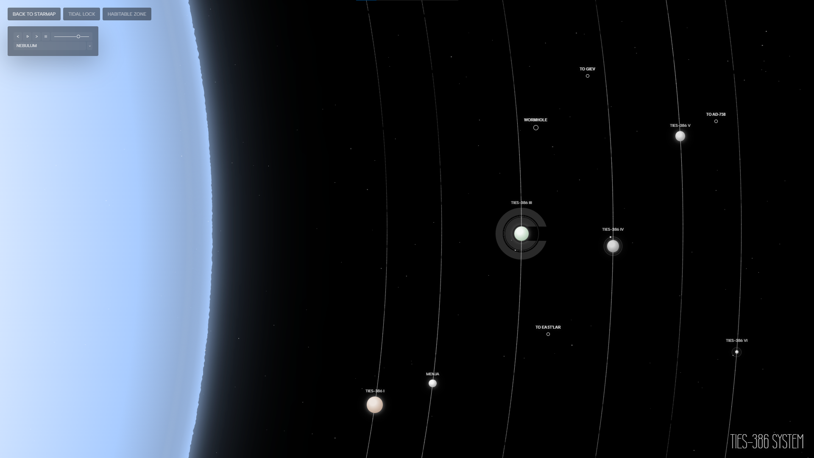
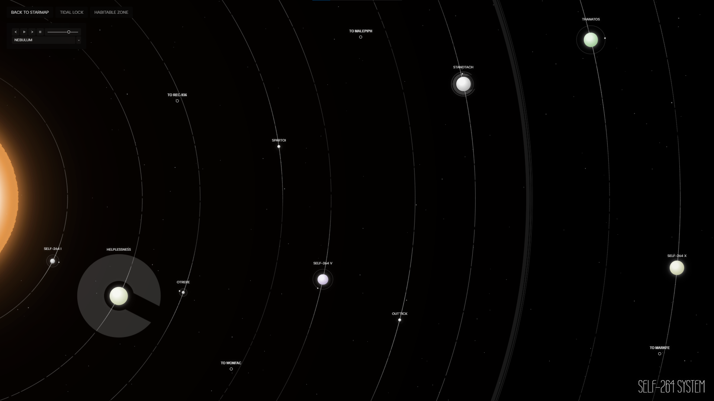

# Nebulum

Nebulum is an interactive procedural space generator built with Vite and Three.js.

The entire universe is generated deterministically from a seed string. Stars, constellation links, names, star classes, planets, moons, sky gradients, and ambient effects are all driven by seeded randomness - the same seed always yields the same universe.

## Screenshots

### Star map

The seeded 3D constellation graph with glowing stars and links.



### Region masks

Paint connected star regions into colored constellations with the borders tool.



### Star system view

Each star is a fully explorable system with orbits, planets, moons, asteroid belts, and accretion disks.



### Habitable and tidal-lock zones

Toggle astrophysics-based overlays — the habitable zone and the tidal-lock zone — scaled per star class.



## Features

- Seeded 3D star map with glowing stars, links, and external fading links.
- Mouse drag rotation with inertial slowdown.
- Hover labels and animated typewriter tooltips.
- Procedural sky gradient and distant star field.
- Clickable colored masks for connected star regions.
- Custom color picker for mask and sky gradient colors.
- 14 real-world star classes - from Red Dwarf to Neutron Star, Strange Star, and Black Hole.
- Explorable star systems with procedural planets, moons, asteroid belts, accretion disks, and jump gates.
- Astrophysics-based habitable and tidal-lock zone overlays, scaled per star class.
- Mythology-based procedural planet names (Greek, Norse, Egyptian) plus a syllable generator.
- Built-in music player with shuffle and ordered playback.

## Development

Install dependencies:

```bash
npm install
```

Run locally:

```bash
npm run dev
```

Build:

```bash
npm run build
```

Preview the production build:

```bash
npm run preview
```

## GitHub Pages

The repository includes a GitHub Pages workflow. After pushing to GitHub, enable Pages with **GitHub Actions** as the source in repository settings.
